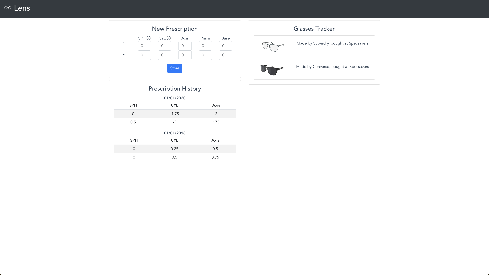

# Lens

Lens is a self-hosted application for storing and tracking opticians prescriptions and eyewear over time



## Setup

### Running Locally with NPM

First start the database
```bash
cd server/
npm run db
```

Then start the app
```bash
cd client/
npm run serve
```

### Running with Docker Compose

```
docker-compose up
```

## Features

- Historical tracking of prescriptions
- Inventory of pairs of glasses
- Simple method of input

## Roadmap

- [x] Integrate database for persisting data
- [ ] Unit test everything
- [x] Containerise the app
- [ ] Page describing the parts of a prescription
- [ ] Generate a brief description of the latest prescription
- [ ] Reminder to book next test (based on optician recommendations)
- [x] Warning when a pair of glasses is not on the newest prescription
- [ ] Scan a website to import information about a pair of glasses (scrapers)
